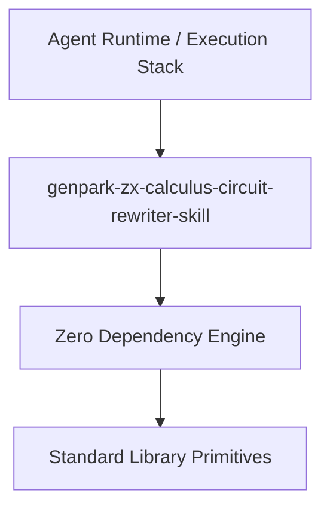

# genpark-zx-calculus-circuit-rewriter-skill

[](https://github.com/alphaparkinc/genpark-zx-calculus-circuit-rewriter-skill)
[](https://github.com/alphaparkinc/genpark-zx-calculus-circuit-rewriter-skill)
[](https://www.python.org/)

ZX-Calculus graph rewrite engine applying spider fusion, phase addition modulo 2pi, and identity reduction to optimize quantum circuit T-count.



## Features
- **Strict 0 Pip Dependencies**: Built completely using the Python Standard Library.
- **Fast Execution & Verification**: Includes client wrapper, MCP server, and verified test suites.
- **Agentic AI Ready**: Exposes standard MCP tools for continuous LLM integration.

## Installation & Quickstart
```bash
git clone https://github.com/alphaparkinc/genpark-zx-calculus-circuit-rewriter-skill.git
cd genpark-zx-calculus-circuit-rewriter-skill
python example_usage.py
```
